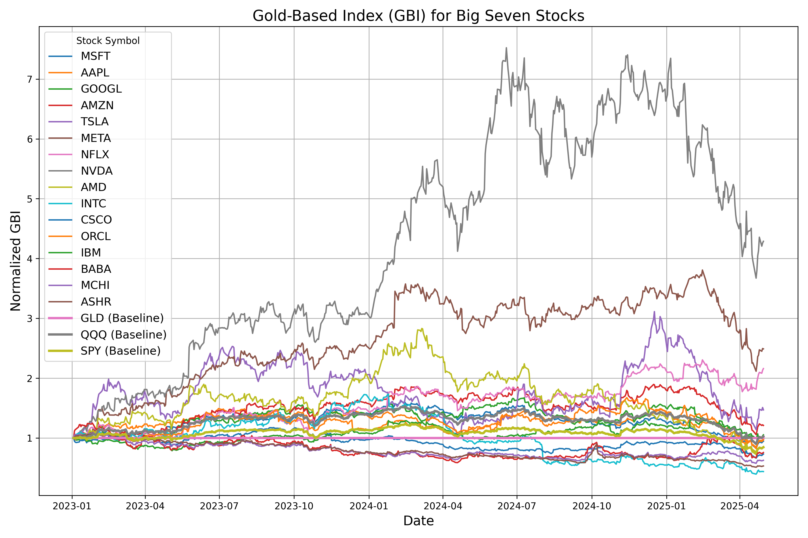

# The Gold-Base-Index for the Big Seven

## What is GBI (Gold-Base-Index)?

The Gold-Base-Index (GBI) represents a stock's value relative to gold, normalized to a base date. It is calculated as:

$$\text{GBI}(\text{STOCK}) = \frac{\text{STOCK}/\text{GLD}}{\text{GBI}_{\text{base}}(\text{STOCK})}$$

Where:
- $\text{STOCK}$ is the stock price in USD
- $\text{GLD}$ is the gold price in USD
- $\text{GBI}_{\text{base}}(\text{STOCK})$ is the value of this ratio on the base date (2023-01-01)

## Today's GBI for the Big Seven

>[!NOTE]
> Update in daily basis.

