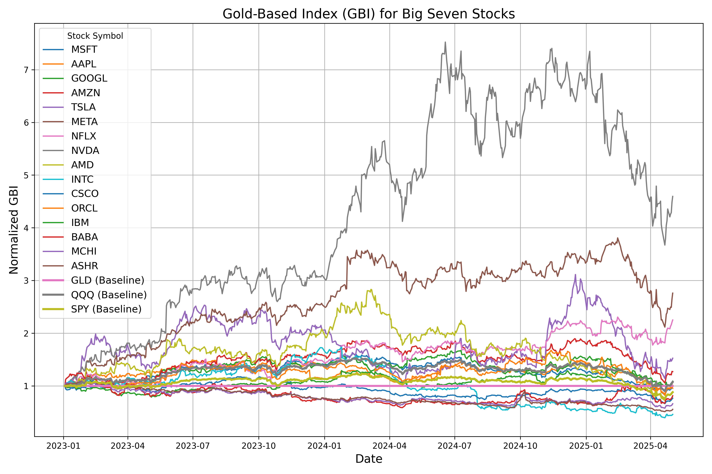

# The Gold-Base-Index for the Big Seven

## What is GBI (Gold-Base-Index)?

The Gold-Base-Index (GBI) represents a stock's value relative to gold, normalized to a base date. It is calculated as:

$$\text{GBP}(\text{STOCK}) = \frac{\text{\$STOCK}}{\text{\$GLD}}$$

$$\text{GBI}(\text{STOCK}) = \frac{\text{GBP(STOCK)}}{\text{GBP}_{\text{base}}(\text{STOCK})}$$

Where:
- $\text{\$STOCK}$ is the stock price in USD
- $\text{\$GLD}$ is the gold price in USD
- $\text{GBP}_{\text{base}}(\text{STOCK})$ is the value of $GBP$ on a selected base date (default: 2023-01-01)

## Why GBI?

In recent years, we've witnessed what financial media breathlessly calls "historic rallies" and "unprecedented gains" in asset prices, particularly in the stock market. Yet one must wonder: are these "gains" anything more than an illusion?

Are we truly wealthier when stocks climb, or are we simply holding the same assets priced in increasingly worthless currency? After all, when everything costs more, perhaps nothing is actually worth more.

To pierce through this veil of monetary manipulation, we need a more honest metric than the stock price itself—something less susceptible to the whims of central bankers and their printing presses. Therefore, we introduce the Gold-Base-Index (GBI), which uses gold—humanity's ancient monetary constant—instead of the ever-depreciating USD as the measuring stick.

This allows us to answer a far more relevant question: "How much have these stocks truly appreciated in real, enduring value?" The answer, as you might suspect, often proves far less impressive than the headlines would have you believe.

## Today's GBI for the Big Seven

>[!NOTE]
> Update in daily basis.

